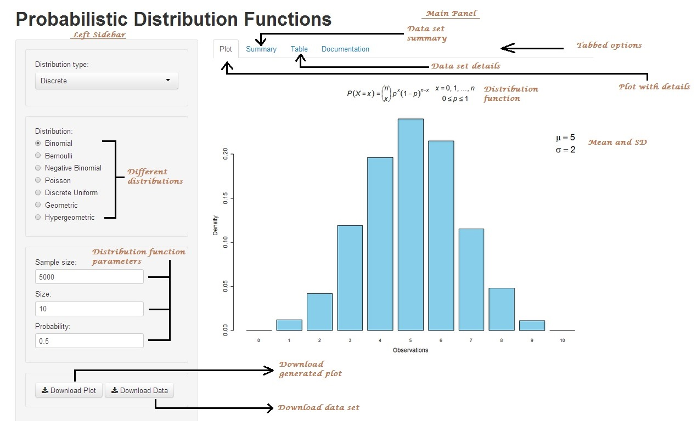
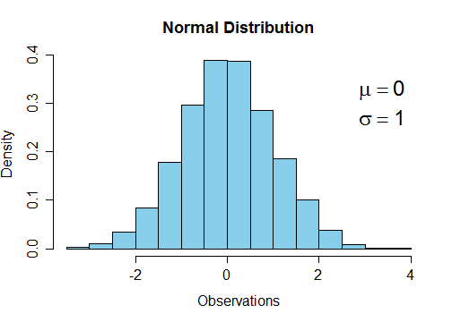

---
title       : Probabilistic Distribution Functions
subtitle    : 
author      : Dipanjan Sarkar
job         : Data Engineer @DataWeave
logo        : logo.jpg
framework   : revealjs        # {io2012, html5slides, shower, dzslides, ...}
revealjs    : {theme: serif}
highlighter : highlight.js  # {highlight.js, prettify, highlight}
hitheme     : tomorrow      # 
widgets     : [mathjax]            # {mathjax, quiz, bootstrap}
mode        : selfcontained # {standalone, draft}
knit        : slidify::knit2slides
---  


<h2 align='left'> Probabilistic Distribution Functions App</h2>
<br><br><br><br><br><br><br>
<h5> Dipanjan Sarkar</h5>
<h6> Data Engineer @DataWeave</h6>


--- 

## Motivation  

<br>
#### <u>Audience</u>

   - Data Analysts & Scientists
   - Mathematicians
   - Statisticians

<br>
#### <u>Description</u>

It provides an interactive and easy way to view different 
probabilistic functions. You can view both discrete and 
continuous distribution functions and modify different 
parameters and see how the distributions change.

<br>
#### <u>Significance</u>

The visual component of distribution functions is often neglected in 
statistical books. Now, you have a chance to interact with the
function parameters to see how distributions change based on them.

--- 

## App Layout



--- 

## How it works?

We get the chosen parameters from the user in the UI and then run server code similar to the segment below.

```r
d<-rnorm(5000) # gets parameter options from left panel and forms the plot below
hist(d,main='Normal Distribution',xlab="Observations",ylab="Density",col="skyblue",cex.main=1.5,
    cex.axis=1.3,cex.lab=1.3,prob=T) # plot gets generated on the right tabbed panel
legend("topright", inset = 0.025,legend=bquote(atop(mu==.(round(mean(d))),
       sigma==.(round(sd(d))))), bty = "n", cex = 2, text.col = 'black', text.font = 2)
```



--- 
## App features

<br>
The main features of the app are mentioned below.
   - View interactive plots for different probabilistic distribution functions.
   - Supports both discrete and continuous functions.
   - Supports a wide array of probabilistic functions.
   - Customizable function parameters
   - Ability to view formulae, summary statistics and raw data along with plots.
   - Download features for plots and datasets.
   
